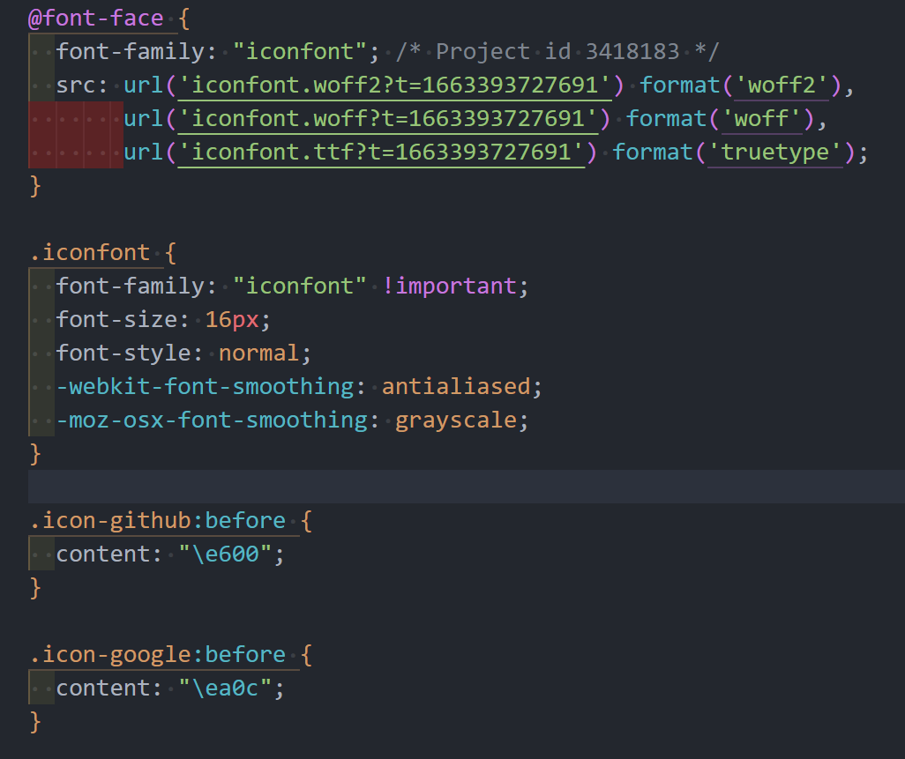

# 引入字体图标

## iconfont

> [iconfont 官网](https://www.iconfont.cn/)
> [iconfont 使用说明](https://www.iconfont.cn/help/detail?spm=a313x.manage_type_myprojects.i1.d8cf4382a.149a3a81WjbIu7&helptype=code)

## Font Awesome

> [Font Awesome](https://fontawesome.com/search?o=r&m=free)

## Google Fonts

> [Google Fonts](https://fonts.google.com/)

## 其他

### 伪元素插入字体图标

> 在某些情况下，可能无法通过 HTML 标签来定义图标（如：对第三方组件添加自定义图标），此时可通过 css 伪元素插入字体图标。

这种方式的思路也来源于 **Font class** 的实现原理，`iconfont.css` 文件部分代码如下：



它其实就是根据 `@font-face` 自定义了一套字体，接着定义一个 **iconfont** 类名，定义基本的图标样式，再通过不同类名，如：`icon-github`、`icon-google` …… 给伪元素设置 `content` 内容，来定义不同的图标类型。所以一般在使用的时候，我们直接添加 class 就可以引入图标了。

了解原理后，我们在使用的时候，就可以直接跳过封装类名的这一步，我们引入 iconfont 字体后，手动给某个元素的伪元素设置 content 即可。

```css
/* 1.引入 iconfont 字体 */
@import url(./iconfont/iconfont.css);

/* 2.给需要的元素指定 iconfont 字体 */
.foo::before {
  font-family: 'iconfont';
  content: '\e600';
}
```

### 伪元素设定图片背景

> 插入图标时，可能找不到需要的图标，而且也依赖于字体文件，于是就可以采用图片作为伪元素背景的方式。

```css
.foo::after {
  content: '';
  display: inline-block;
  width: 16px;
  height: 16px;
  background: url(./fe.png) no-repeat scroll center / cover;
}
```