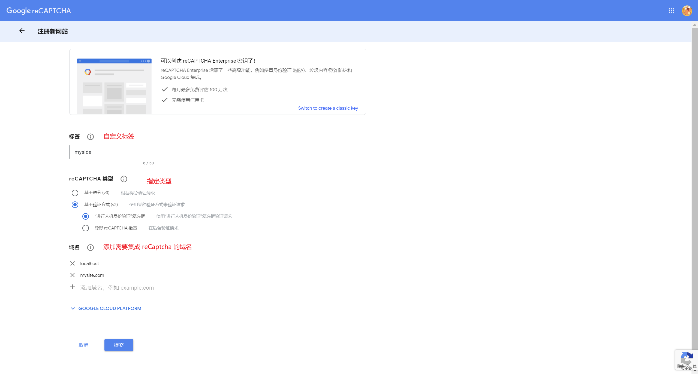
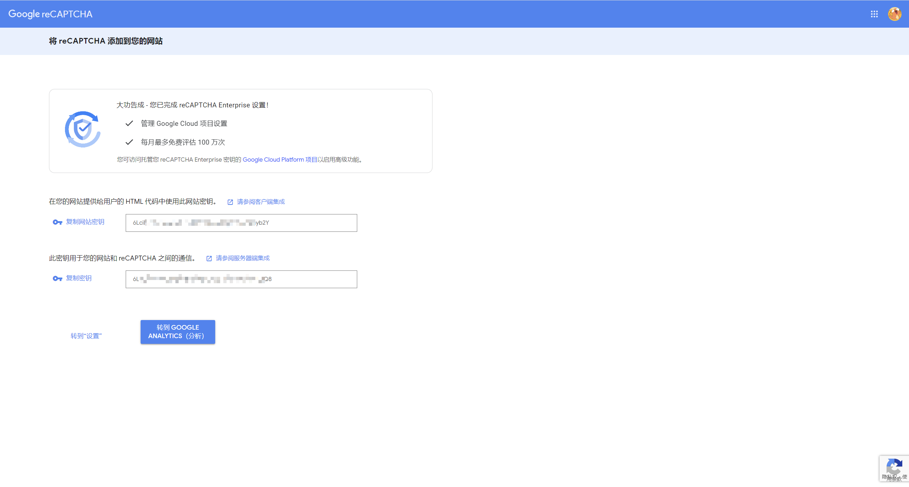

# 人机校验

## reCAPTCHA

> 参考：[Google reCAPTCHA](https://www.google.com/recaptcha)

### 1. reCAPTCHA 注册

注册网站。



获取公钥、私钥。



### 2. 流程分析

1. 前端根据指定业务场景渲染 reCAPTCHA，通过前端人机校验后，会返回一个 token，再将该 token 返回给后端。
2. 后端根据 token 去调用 reCAPTCHA 提供的校验接口，返回 json 校验信息。后端根据该 json 返回状态给前端。
3. 前端再通过不同状态进行不同交互处理。

### 3. 客户端

#### 3.1. 核心操作

1. 引入 reCAPTCHA。

    ```html
    <!-- 国内无法访问 google，可将 `www.google.com` 替换为 `www.recaptcha.net`。 -->
    <script src="https://www.recaptcha.net/recaptcha/api.js" async defer></script>

    <!-- 定义 reCAPTCHA 元素 -->
    <div id="recaptcha"></div>
    ```

2. 使用 reCAPTCHA。

    ```js
    // 声明 grecaptchaId
    let recaptchaId = -1
    // 手动渲染加载 reCAPTCHA，会返回一个 id 用于指定该 reCAPTCHA
    recaptchaId = globalThis.grecaptcha.render('recaptcha', {
      sitekey: '公钥',
      // reCAPTCHA 前端校验成功回调，会返回一个 token
      callback: async token => {
        // 将校验 token 返给后端进行校验，后端成功校验后再执行额外操作
        const status = await myCheck(token)
        if (status) {
          // ...
        } else {
          // ...
        }
      }
    })
    ```

3. 其他操作（可选）

    ```js
    // 重置 reCAPTCHA，可用于刷新重置人机校验窗口
    globalThis.grecaptcha.reset(recaptchaId)
    ```

### 4. 服务端

服务端以 Java 为例：

```java
public String check(HttpServletRequest request) {
  String checkCode = request.getParameter("token");
  Map<String, Object> map = new HashMap<>();
  map.put("secret", "私钥");
  map.put("response", checkCode);
  String json = MyHttpRequest.sendPost("https://www.recaptcha.net/recaptcha/api/siteverify", map, "UTF-8");
  return json;
}
```
