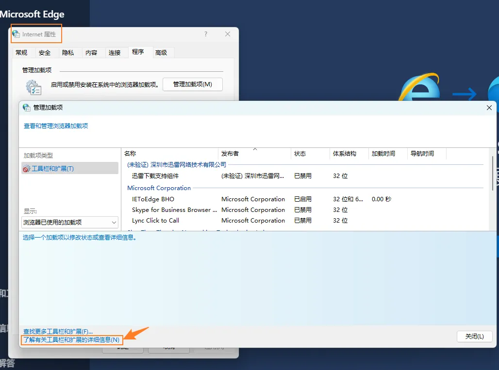

# Internet Explorer （IE）浏览器

## win11 开启 IE

虽然 IE 已死，但是有时仍然需要用到 IE 做测试，win11 默认关闭了 IE，可如下开启：



## IE 兼容性提示

可参考：<https://www.mediacollege.com/internet/html/detect/detect-IE.html>

### 如果浏览器是 Internet Explorer 时显示此内容

```html
<!--[if IE]>
Place content here to target all Internet Explorer users.
<![endif]-->
```

### 如果浏览器不是 Internet Explorer 时才显示此内容

```html
<![if !IE]>
Place content here to target all users not using Internet Explorer.
<![endif]>
```

### 如果浏览器版本大于或等于 8 时显示此内容

```html
<!--[if gte IE 8]>
Place content here to target users of Internet Explorer 8 or higher.
<![endif]-->
```

### 如果浏览器版本小于 7（即 6 或更低）

```html
<!--[if lt IE 7]>
Place content here to target users of Internet Explorer 6 or lower (less than 7).
<![endif]-->
```
